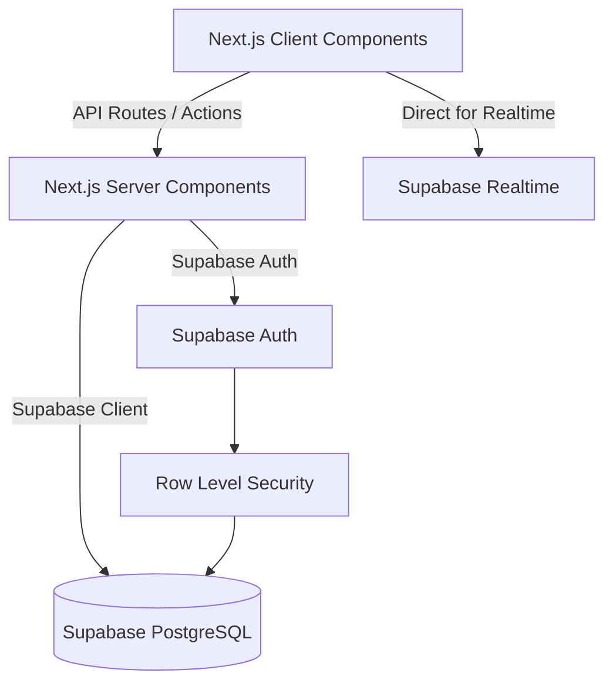

# Enterprise Application Development Plan

## 1. Executive Summary
This development plan outlines the architecture and phased execution for building the new Cholistan Tractors application. Based on the re-audit of the legacy systems, the WordPress plugin (`cholistan-tractors-manager`) was identified as the fully functional MVP containing the true business schema and logic. The new application will migrate this exact domain knowledge into an enterprise-grade solution built with Next.js App Router, TypeScript, Vercel, and Supabase, prioritizing API-first design and scalability.

## 2. Business Requirements Carried Forward
The following domain entities and workflows will be strictly carried forward from the WordPress MVP:
- **Sales Flow**: Cash vs. Credit sales, categorization (General/Workshop), invoicing, partial payments, and balances.
- **Inventory Management**: Tracking discrete categories (Oil, Filters, Parts) with low stock thresholds, unit prices, and cost prices.
- **CRM / Contacts**: Distinct profiling for Customers, Mechanics (General/Company), Company Officials, and Business Officials.
- **Financials**: Multi-method payments and comprehensive expense tracking.
- **Auditing**: Full tracking of user actions on entities.

## 3. Features to Preserve
- The exact database schema entities mapped in the WP Plugin (e.g., `sales`, `sale_items`, `payments`, `expenses`, `mechanics`).
- The reporting formulas for profit/loss calculation.

## 4. Features to Redesign
- The Monolithic WP architecture.
- The UI, moving from WP Admin pages to a bespoke, modern Next.js dashboard.
- Authentication, moving from WP Users to Supabase Auth.

## 5. Features to Remove
- The Django scaffold codebase entirely.
- The WordPress core dependency.

## 6. Requirements Requiring Clarification
- Exact details on how historical records from the WP tables will be migrated to Supabase.
- Any new roles needed beyond the standard WP admin capabilities previously used.

## 7. Recommended Target Architecture
- **Frontend**: Next.js with App Router, React Server Components.
- **Language**: TypeScript.
- **Backend/Database**: Supabase (PostgreSQL, Auth, RLS, Edge Functions).
- **Hosting**: Vercel.

## 8. API-First Architecture
The architecture will rely on Next.js Server Actions and Route Handlers as the API layer, securely interacting with Supabase.
- **Authentication**: JWT via Supabase Auth.
- **Authorization**: Row Level Security (RLS) in PostgreSQL.
- **Future Flutter Integration**: Flutter will connect directly to the Supabase Postgres instance using the Supabase Flutter SDK, enforcing the same RLS policies without duplicate backend work.

## 9. Database Architecture
Core Entities (Ported from MySQL to PostgreSQL):
- `users` (Supabase Auth)
- `sales` (invoice_no, sale_type, total, discount, balance)
- `sale_items` (item_type, qty, unit_price, cost_price, line_total)
- `payments` (amount, method, reference)
- `expenses` (description, amount, method, approval chain)
- `mechanics` & `company_officials` & `business_officials`
- `audit_log`

## 10. Authentication and Authorization
- **Authentication**: Supabase Auth.
- **Roles**: Mapped from the legacy `class-ctm-roles.php` logic into a PostgreSQL `profiles` table.
- **RLS**: Policies will restrict read/write access based on user roles natively in the database.

## 11. Application Modules
- **Inventory Module**: Manage Oil, Filters, and Parts.
- **Sales Module**: POS-like interface for creating invoices and receiving payments.
- **Expenses Module**: Track operational costs.
- **Contacts Module**: Manage mechanics and officials.
- **Reports Module**: Profit/Loss, Sales summaries, Inventory alerts.

## 12. Frontend Architecture
- **App Router**: Organized by module (e.g., `/app/sales/new`, `/app/inventory/oil`).
- **Server Components**: Direct Supabase fetching for fast page loads.
- **Validation**: Zod schema validation matching the strict DB constraints found in the WP Plugin.

## 13. Supabase Architecture
- **PostgreSQL**: Robust relational storage.
- **Auth**: Secure user management.
- **RLS**: Enforcing business rules at the database layer.

## 14. Vercel Architecture
- Standard CI/CD flow: GitHub PR -> Preview Deployment -> Production.

## 15. Testing Strategy
- **Unit Testing**: Vitest for migrating the complex logic found in `class-ctm-sales-service.php`.
- **E2E Testing**: Playwright for the invoicing and checkout flows.

## 16. Security Architecture
- RLS ensures data isolation.
- Server Actions validate input to prevent injection.

## 17. Data Migration Strategy
A custom Node.js script will be required to extract the data from the MariaDB/MySQL WordPress tables and seed it into the new Supabase PostgreSQL instances, preserving foreign keys (e.g., `sale_id`).

## 18. Future Flutter Strategy
The use of Supabase guarantees that Flutter can consume the exact same database securely using the Supabase Flutter SDK and RLS.

## 19. Development Phases
- **Phase 0**: Data extraction mapping from WordPress to Supabase.
- **Phase 1**: Supabase PostgreSQL Schema creation (translating `class-ctm-activator.php`).
- **Phase 2**: Next.js App Router scaffolding and Authentication.
- **Phase 3**: Inventory and Contacts Modules.
- **Phase 4**: Sales and Expenses Modules (incorporating service logic).
- **Phase 5**: Reporting and Dashboards.
- **Phase 6**: Data Migration and QA.
- **Phase 7**: Production Deployment.

## 20. Implementation Priority

| Priority | Module/Feature | Reason | Dependencies |
|----------|----------------|--------|--------------|
| 1 | DB Schema Porting | Must exactly match WP schema capabilities | None |
| 2 | Auth | Required for RLS | DB Schema |
| 3 | Inventory & Contacts | Base entities required for sales | Auth |
| 4 | Sales Invoicing | Core workflow | Inventory, Contacts |
| 5 | Reports | Business intelligence | Sales |

## 21. Decisions Required Before Development
- Confirm cutover strategy for data migration from live WP to Next.js.
